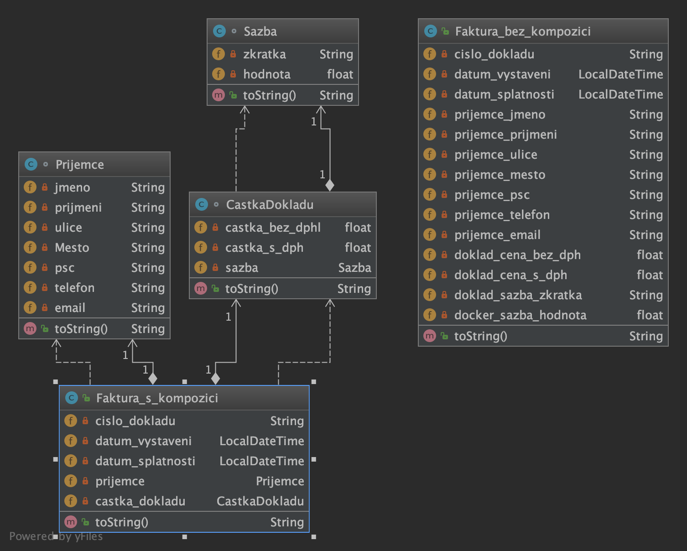

##Objects Composrion

Benefit of using composition in java is that we can control the visibility of other object to client classes and reuse only what we need.

#####Benefits in testing
While using composition, testing becomes much more easy, as now you should not test one large object but can divide and test small objects separately.
